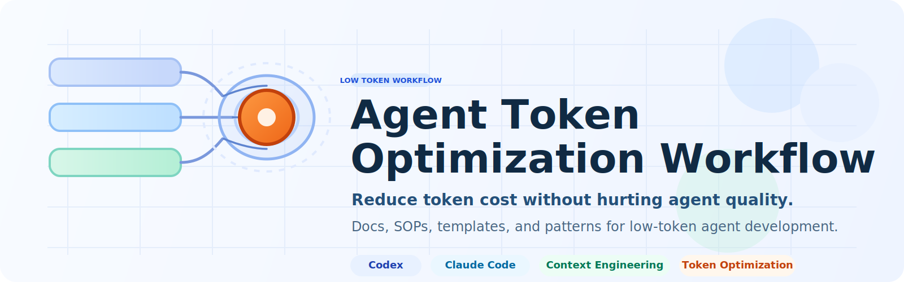

<p align="center">
  
</p>

# Agent Token Optimization Workflow

A documentation-first workflow for reducing token consumption in agent-driven development without degrading session quality, skill recall, or task success rate.

适用范围：`Codex`、`Claude Code` 及其他通用 Agent CLI。

## At a Glance

- Reduce fixed context cost
- Reduce repeated context loading
- Keep critical skill recall stable
- Keep simple tasks fast
- Support dynamic skill discovery as projects evolve

## Quick Start

### Existing project

1. Read [the summary](docs/token-optimization-summary.md).
2. Copy the existing-project prompt from [templates/prompt-templates.md#existing-project-prompt](templates/prompt-templates.md#existing-project-prompt).
3. Generate or update:
   - `PROJECT_CONTEXT.md`
   - `PROJECT_SKILLS.md`
   - `docs/token-optimization/token-optimization-report.md`
   - `docs/token-optimization/token-optimization-checklist.md`
4. Follow [the SOP](STANDARD_OPERATING_PROCEDURE.md).

### New project

1. Read [the summary](docs/token-optimization-summary.md).
2. Copy the new-project prompt from [templates/prompt-templates.md#new-project-prompt](templates/prompt-templates.md#new-project-prompt).
3. Initialize:
   - `PROJECT_CONTEXT.md`
   - `PROJECT_SKILLS.md`
   - `SESSION_SUMMARY_TEMPLATE.md`
4. Use [the checklist](docs/token-optimization-checklist.md) to keep the setup lightweight.

## Minimal Adoption

If you only do one thing, do this:

1. Create `PROJECT_CONTEXT.md`.
2. Create `PROJECT_SKILLS.md`.
3. Use [the checklist](docs/token-optimization-checklist.md).

This gives you the lowest-friction version of the workflow.

## Copy-and-Use Entry Points

- Existing projects: [templates/prompt-templates.md#existing-project-prompt](templates/prompt-templates.md#existing-project-prompt)
- New projects: [templates/prompt-templates.md#new-project-prompt](templates/prompt-templates.md#new-project-prompt)
- Team conventions: [TEAM_GUIDE.md](TEAM_GUIDE.md)
- Execution flow: [STANDARD_OPERATING_PROCEDURE.md](STANDARD_OPERATING_PROCEDURE.md)

## Who This Is For

- teams using CLI agents in daily engineering work
- maintainers of long-running agent-assisted projects
- people designing reusable prompt, context, and skill-loading conventions
- anyone trying to lower token cost without hurting real task performance

## What You Get

- a team guide for shared principles
- an SOP for repeatable execution
- a full report explaining the architecture and trade-offs
- an implementation checklist
- reusable prompt templates for existing and new projects
- an external-share package for lightweight distribution

## What Problems This Solves

Many agent projects become expensive for the wrong reasons:

- oversized global instructions
- repeated loading of the same context
- overexposed skill catalogs
- long raw session history
- no mechanism to discover new skills as projects evolve

This repository packages a practical workflow to reduce those costs without making agents dumber, slower, or more fragile.

## Core Ideas

- Optimize fixed context cost before cutting capabilities.
- Keep skill installation broad, but default exposure narrow.
- Keep indexes resident, but load detailed content on demand.
- Replace long raw history with structured summaries.
- Support dynamic skill recall when new domains or task types appear.

## What You Will End Up With

Teams using this workflow should aim to achieve:

- lower fixed token cost per session
- lower repeated context cost in long conversations
- stable or improved skill recall
- no significant increase in clarification rounds
- no significant regression in task success rate

## Repository Structure

```text
.
├─ README.md
├─ LICENSE
├─ CHANGELOG.md
├─ TEAM_GUIDE.md
├─ STANDARD_OPERATING_PROCEDURE.md
├─ docs/
│  ├─ token-optimization-summary.md
│  ├─ token-optimization-report.md
│  └─ token-optimization-checklist.md
├─ templates/
│  └─ prompt-templates.md
└─ external-share/
   ├─ README.md
   ├─ 01-summary.md
   ├─ 02-team-guide.md
   ├─ 03-sop.md
   ├─ 04-checklist.md
   ├─ 05-prompt-templates.md
   └─ appendix-full-report.md
```

## Recommended Reading Order

1. [docs/token-optimization-summary.md](docs/token-optimization-summary.md)
2. [TEAM_GUIDE.md](TEAM_GUIDE.md)
3. [STANDARD_OPERATING_PROCEDURE.md](STANDARD_OPERATING_PROCEDURE.md)
4. [docs/token-optimization-report.md](docs/token-optimization-report.md)
5. [docs/token-optimization-checklist.md](docs/token-optimization-checklist.md)
6. [templates/prompt-templates.md](templates/prompt-templates.md)

## External Sharing

If you want to share a lighter package, use [external-share/](external-share/). It contains a more presentation-friendly copy of the core materials.

## License

This repository is prepared with an MIT license by default. Change it if your distribution policy requires a different license.


