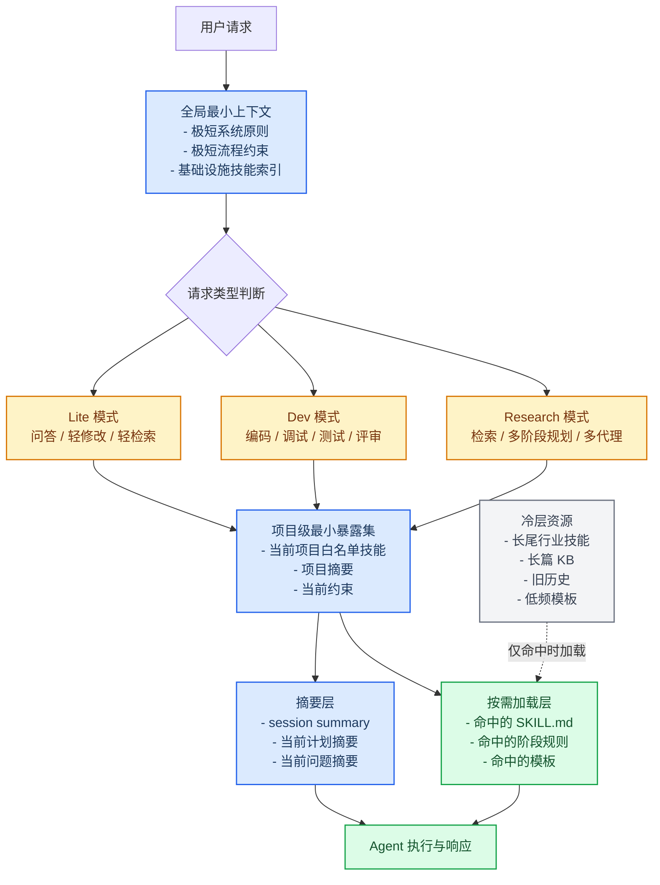
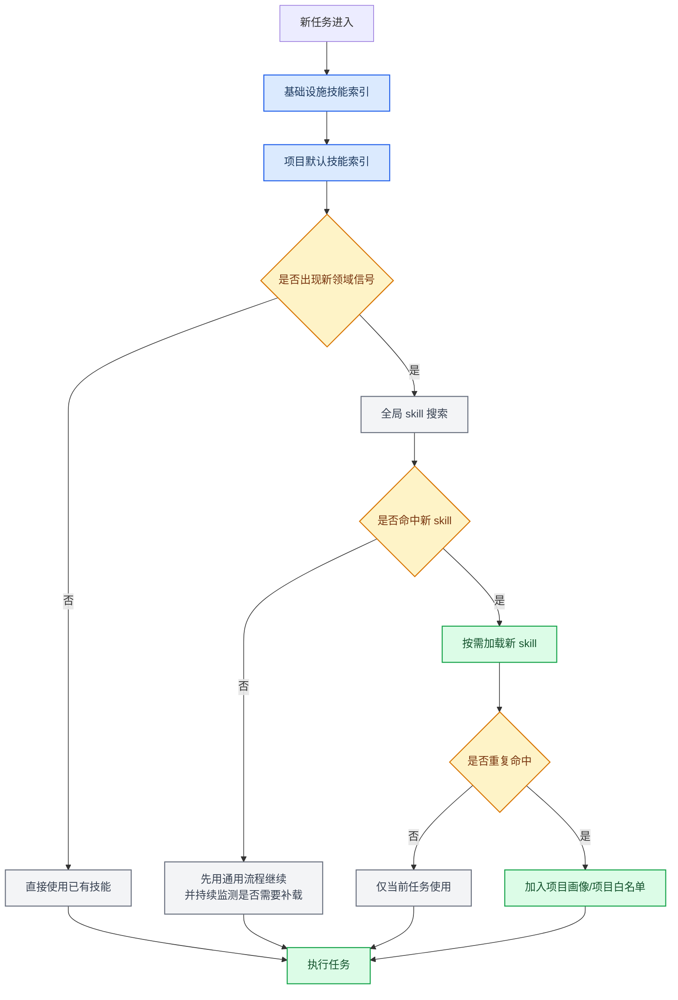

# Agent Token 消耗优化方案汇报

适用范围：Codex、Claude Code 及其他基于 CLI / Agent 的通用工作流

## 1. 目标与约束

本方案的目标不是单纯压低 token，而是在不明显影响每个 session 首轮响应质量、技能召回能力、任务成功率和交互体验的前提下，降低固定上下文成本与重复加载成本。

优化约束如下：

- 不以削弱关键能力为代价换取 token 节省。
- 不默认隐藏所有技能，避免该用时无法召回。
- 不增加首轮澄清轮次和错误决策率。
- 不依赖某一家 agent 产品的私有机制，优先采用通用目录组织与按需加载思想。

## 2. 结论摘要

真实的 token 浪费，通常不来自“磁盘上安装了很多 skills”，而来自以下几类固定或重复注入：

- 超长全局系统提示、协议文件、AGENTS.md。
- 每次启动都重复注入的大量技能清单或技能正文。
- 会话历史原文、长篇 KB、长篇 session 记录的重复携带。
- 进入具体任务前就预先加载了大量实际上不会使用的规则和说明。
- 多轮对话中反复注入同一批上下文，而不是引用短摘要。

因此，最有效的优化方向是：

- 缩短全局常驻上下文。
- 将技能与规则拆分为“索引常驻、正文按需”。
- 为项目建立最小默认暴露集，而不是全量暴露所有长尾技能。
- 用结构化摘要替代长历史原文。
- 用量化指标验证“省 token”没有换来“体验退化”。

## 3. Token 过度消耗的可能原因

### 3.1 固定启动成本过大

每次 session 一开始就加载过长的系统提示、全局协议、技能索引、工作流规范，会形成高固定成本。即使本轮任务很简单，也要先支付这笔上下文税。

典型表现：

- 首轮还没做实质工作，token 已经消耗很多。
- 简单问答和复杂编排在启动成本上差异不大。
- 每次新开 session 都重复出现类似的大段规则。

### 3.2 技能发现机制过于“全量化”

虽然安装很多 skills 本身不直接花 token，但如果平台把所有技能名称、描述甚至正文都放入上下文，token 就会随着技能数量线性增长。

风险点：

- 低频、长尾、行业专用技能占用大量默认上下文。
- agent 为了“保险”会过度检查技能，导致额外 token 开销。

### 3.3 会话历史与知识库携带过重

很多系统会把上一轮长会话、长计划、长知识库、长日志直接带入新轮次。这样虽然增强连续性，但也显著增加上下文成本。

风险点：

- 历史信息重复率高，但仍被整段携带。
- 旧约束与旧结论已经过时，却继续消耗 token。
- 长对话越滚越大，后期每轮都更贵。

### 3.4 规则未做分层

如果“路由规则、设计规则、开发规则、知识库规则、审查规则”全部常驻，那么即使本轮只是轻问答，也会承担完整工作流的上下文成本。

### 3.5 缺少模式切换

轻任务、开发任务、研究任务共用同一套重配置时，简单任务会被复杂模式拖累。

### 3.6 重复注入而非引用摘要

同一份规则、同一份项目背景、同一份约束在多轮对话中被完整重复注入，而不是替换成稳定的短摘要或缓存键。

## 4. 优化原则

### 4.1 优先削减固定成本，不优先削减能力

优先优化以下对象：

- 全局常驻提示长度。
- 启动阶段自动读取的文件数量。
- 历史与知识库的默认注入量。
- 长尾技能的默认暴露范围。

不优先优化以下对象：

- 调试、TDD、评审、规划等基础设施能力。
- 当前项目明确高频使用的核心技能。

### 4.2 常驻的是索引，不是正文

默认常驻上下文应只保留：

- 最小工作原则。
- 少量高频技能名及一行摘要。
- 当前项目核心信息摘要。

真正的长文档、长技能正文、详细规则应在命中时再加载。

### 4.3 历史保留“决策信息”，不保留“原始流水账”

默认保留的应是：

- 当前目标。
- 当前状态。
- 关键约束。
- 未决问题。

不默认保留完整原始对话、完整错误日志、完整中间思考。

### 4.4 优化必须可回退、可测量

任何“降 token”改动都应有量化指标，并在体验下降时可以快速撤回。

## 5. 推荐总体方案草图



## 6. 具体优化方案

### 6.1 全局层最小化

将全局常驻内容压缩为一份短 bootstrap，只保留：

- 核心边界。
- 安全原则。
- 路由总则。
- 如何发现技能的最小规则。

不要在全局层常驻：

- 完整多阶段协议。
- 完整知识库规则。
- 所有子代理细节。
- 所有命令说明。

建议做法：

- `global-bootstrap.md`：短，强约束，常驻。
- `design-rules.md`、`develop-rules.md`、`kb-rules.md`：按阶段懒加载。

### 6.2 技能分层

建议把技能分为三层。

#### A. 基础设施层，默认可见

这类技能不建议冷藏：

- debugging
- tdd
- review
- planning
- documentation

原因：它们不是领域能力，而是工作流基础能力。

#### B. 项目高频层，项目级默认可见

每个项目维护自己的最小默认暴露集，例如：

- 当前框架技能。
- 当前语言技能。
- 当前测试与构建技能。
- 当前项目经常使用的 5 到 15 个技能。

#### C. 长尾冷层，仅命中时加载

这类技能默认不进入会话上下文：

- Unity
- 医学专用
- 论文与科研数据库
- 图像海报
- 冷门行业工具

### 6.3 从“全量暴露”改为“索引常驻、正文按需”

常驻的不是所有 `SKILL.md` 正文，而是：

- skill 名称
- 一句话描述
- 触发关键词

正文只在以下情况读取：

- 用户明确点名 skill。
- 任务语义命中 skill。
- 当前阶段明确要求某类 skill。

### 6.4 会话模式化

建议在所有 agent 中引入轻量模式切换。

#### Lite

适用于：

- 问答
- 翻译
- 轻总结
- 轻量单文件修改

默认加载：

- 极短全局规则
- 极短项目摘要
- 基础设施技能索引

#### Dev

适用于：

- 编码
- 调试
- 测试
- 代码评审

额外加载：

- 当前项目技术约束
- 相关开发技能索引
- 当前任务摘要

#### Research

适用于：

- 大规模检索
- 长规划
- 多代理
- 长文档编排

额外加载：

- 研究工作流规则
- 检索技能索引
- 研究上下文摘要

### 6.5 历史压缩策略

不要把原始长会话直接带入下一轮，而是强制沉淀为结构化摘要。

推荐摘要结构：

```text
目标:
当前状态:
关键约束:
已确认决策:
未决问题:
下一步:
```

保留原则：

- 保留结论。
- 保留边界。
- 保留当前阻塞点。
- 不保留冗长原文。

### 6.6 项目级最小上下文文件

建议每个项目维护一个极短文件，例如：

- `PROJECT_CONTEXT.md`

只写以下内容：

- 项目做什么。
- 主要技术栈。
- 核心目录。
- 当前禁区。
- 常用命令。

长度建议控制在一页内。

### 6.7 长文档模块化

对于超长 `AGENTS.md`、超长 KB、超长流程文档，建议拆成模块：

- `routing.md`
- `design.md`
- `develop.md`
- `review.md`
- `knowledge.md`

并通过阶段或命令命中时再读。

### 6.8 建立“冷层不丢失”回退机制

白名单与冷层不能做成“物理删除”，而要做成“默认不暴露、可快速命中”。

保底机制：

- 用户显式提到 skill 名称时必须可加载。
- 当高风险任务命中基础设施技能时必须优先召回。
- 当项目切换时自动切换项目白名单。

### 6.9 项目演化过程中的新 skill 动态召回

这是低 token 架构里必须补上的一层。否则系统虽然省下了默认上下文，但随着项目不断演化，很容易因为默认白名单过窄而漏掉新领域能力。

核心原则不是“预先猜中所有未来 skill”，而是：

- 默认保持项目上下文精简。
- 一旦出现新领域信号，强制执行一次全局 skill 发现。
- 命中新 skill 后按需加载。
- 若新 skill 在该项目中重复出现，则晋升为项目级常驻索引。

建议把 skill 召回分成三层：

#### A. 基础设施技能，始终保留索引

这一层负责兜底，不依赖项目领域变化：

- debugging
- tdd
- review
- planning
- documentation

#### B. 项目默认技能，随项目画像增长

这一层代表当前项目“已经证明高频”的能力集合。它不是固定白名单，而是可增长的项目画像。

建议为每个项目维护一个最小清单，例如：

- 当前技术栈对应 skill
- 当前测试与构建 skill
- 当前项目最近高频出现的 skill
- 最近新增且已重复命中的 skill

#### C. 全局冷层技能，可搜索但不常驻

这一层默认不进入会话上下文，但必须始终可以被搜索和命中：

- 长尾行业技能
- 低频格式技能
- 冷门研究和工具链技能
- 特定视觉、文档、科研数据库技能

只有在命中时，才读取其正文。

#### 新 skill 召回的触发条件

当出现以下任一信号时，建议强制触发一次全局 skill 搜索，而不是只依赖项目白名单：

- 出现新的技术栈、框架、语言或文件类型
- 用户明确提到新领域或新能力
- 当前任务从轻量修改升级为调试、评审、研究或复杂规划
- 当前方案连续失败，怀疑缺少特定流程 skill
- 项目中新出现一个之前未覆盖的子系统、目录或工作流

#### 新 skill 命中后的处理方式

命中新 skill 后，不建议立即永久常驻，而应做分级处理：

- 第一次命中：按需加载正文，仅在当前任务使用
- 短期重复命中：加入项目级默认索引
- 长期高频命中：晋升为项目常驻能力

这样既能控制 token，又能随着项目演化稳定扩充能力边界。



#### 推荐的最小实现

为了让所有 agent 都能落地，而不依赖某一家产品的私有机制，建议使用一个轻量项目文件来记录项目技能画像，例如：

- `PROJECT_SKILLS.md`
- `skills.enabled.json`

文件中至少记录：

- 当前项目默认技能
- 最近新增技能
- 新技能的触发场景
- 哪些技能已经晋升为项目常驻

这能让系统在长期项目演化中持续吸收新能力，而不是反复从零开始判断。

## 7. 不影响性能与体验的护栏

这是本方案最重要的部分。为了省 token，不应牺牲首轮质量。

### 7.1 不可降级能力

以下能力不应默认关闭：

- 调试纪律
- 测试纪律
- 代码审查
- 安全边界
- 当前项目核心技能召回

### 7.2 不可接受的副作用

如果出现以下现象，说明优化过头了：

- 首轮明显更“笨”，召回不到该用的技能。
- 澄清轮次显著增加。
- 简单任务反而更慢。
- 关键任务失败率上升。
- 同一问题需要多轮补上下文才能进入正轨。

### 7.3 强制保留的体验目标

- 简单任务首轮应快速进入实质响应。
- 编码任务应稳定召回调试、测试、评审能力。
- 复杂任务应能够平滑升级到重模式，而不是重新开始构建上下文。

## 8. 推荐实施顺序

### 第一阶段：先测量，不先大改

先记录以下基线：

- 首轮输入到首轮响应的 token 消耗。
- 前 5 轮累计 token。
- 首轮澄清次数。
- 任务完成率。
- 关键任务返工率。

### 第二阶段：先砍固定成本

优先做：

- 缩短全局常驻提示。
- 缩短启动时自动加载的历史。
- 缩短项目默认上下文。

### 第三阶段：再做技能分层

优先做：

- 基础设施技能常驻索引。
- 项目技能白名单。
- 长尾技能进入冷层。

### 第四阶段：最后做复杂懒加载

只有确认平台确实支持按需读取且不会破坏体验，再做更激进的动态加载。

## 9. 验收指标

建议把优化效果定义为同时满足下面两组指标。

### 成本指标

- 首轮固定上下文 token 明显下降。
- 前 5 轮累计 token 下降。
- 简单任务平均成本下降。

### 质量指标

- 首轮命中率不下降。
- 关键技能召回不下降。
- 首轮澄清次数不显著上升。
- 任务成功率不下降。

## 10. 可直接落地的最小版本

如果只做一版低风险优化，建议只做下面五件事：

1. 缩短全局常驻规则文件。
2. 为每个项目建立一个极短 `PROJECT_CONTEXT.md`。
3. 建立项目级 skill 白名单。
4. 建立 session summary 模板，禁止长历史原文直接续带。
5. 将长尾技能转为默认冷层，仅在命中时加载。

这是收益最高、风险最低的一组改动。

## 11. 最终建议

对于多 agent 通用场景，最稳的路线不是“尽量少装 skills”，而是：

- 允许技能安装很多。
- 默认只暴露少量高价值索引。
- 真正使用时再加载正文。
- 用短摘要替代长原文。
- 用阶段化、项目化、模式化方式控制上下文。

这样才能同时做到：

- 降低固定 token 成本。
- 不伤害技能召回。
- 不破坏 session 体验。
- 不把系统改得过于脆弱。
